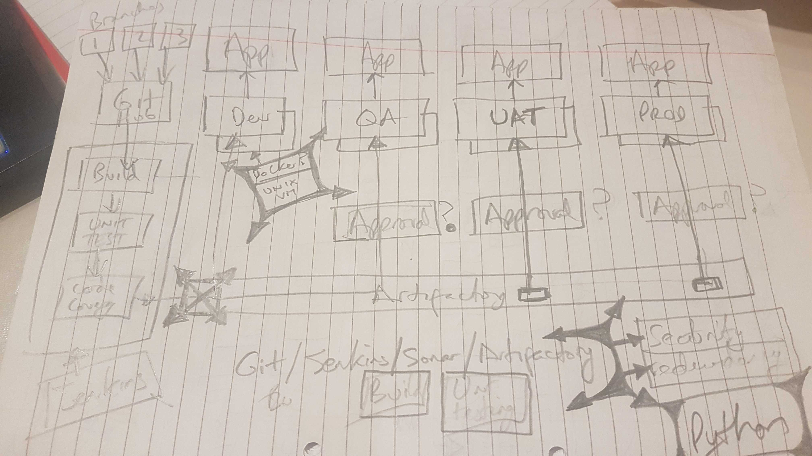
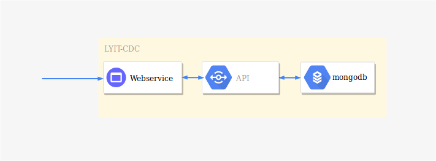

# Architecture

Here we outline not only our current architecture but the journey taken to get there.

# Table of Contents

- [Architecture](#architecture)
- [Table of Contents](#table-of-contents)
  - [Process Architecture](#process-architecture)
  - [Technology Choices](#technology-choices)
  - [Application Artitecture](#application-artitecture)
  - [Software & Versions](#software--versions)

## Process Architecture

## Technology Choices

- Language: Python
- Datastore: Mongo
- Version Control : GitHub
- Issue tracking : JIRA

## Application Artitecture

The application will reside on 2 VMs within the LYIT-CDC datacenter. VM1 will serve as the service endpoint and will host a python webservice. VM2 will host the python API with mongodb datastore. 

## Software & Versions

Software | Versions
------------ | -------------
Linux | 
Mongo | 4.0.6
Python | 
Artifactory | 
Terraform | 
Jenkins | 
Git | 
Vagrant | 
Virtualbox | 
Ansible | 