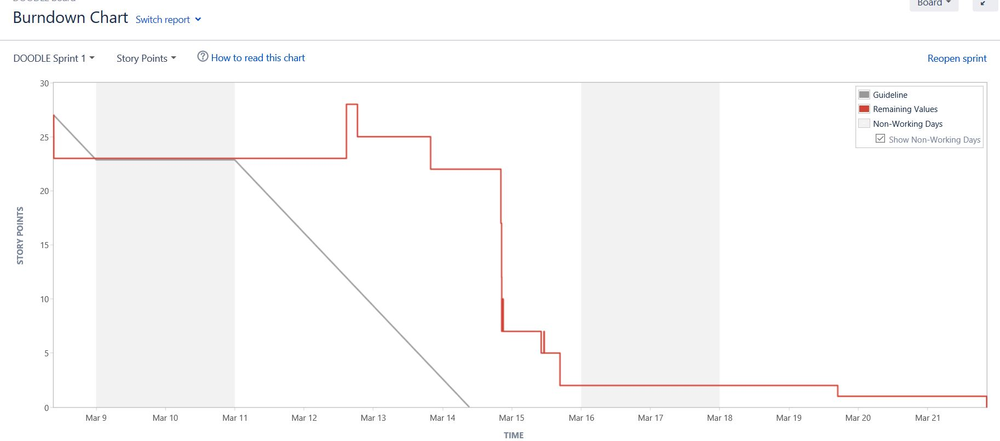
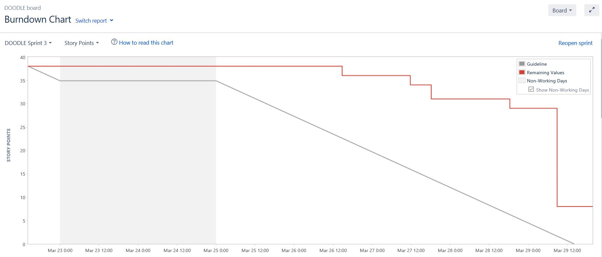
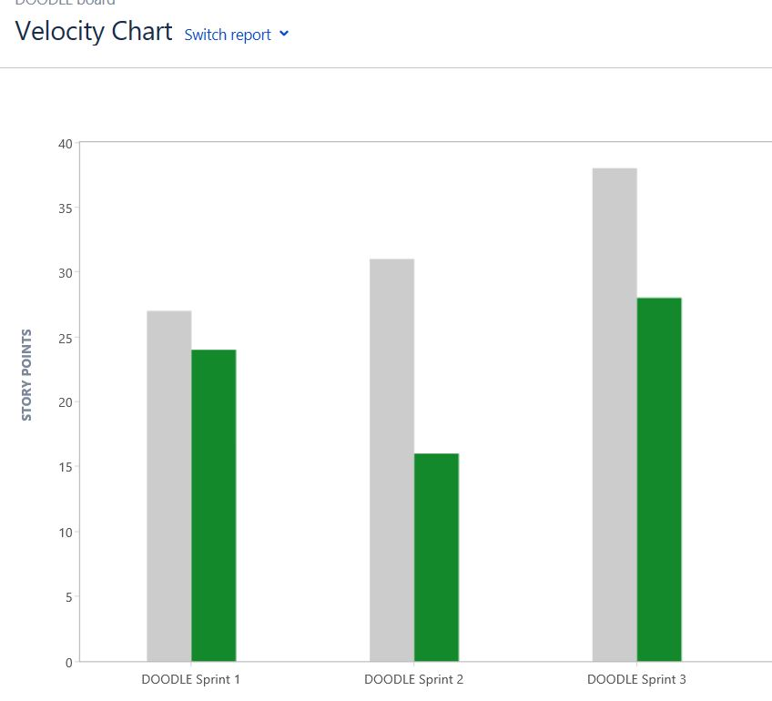
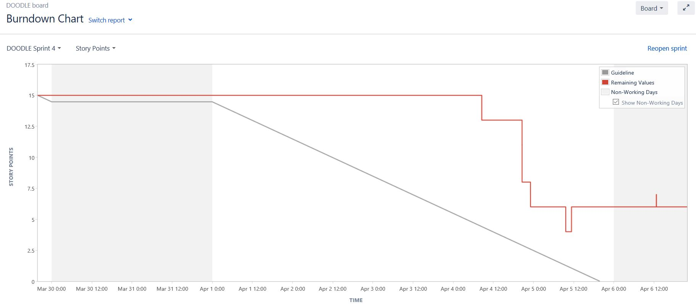
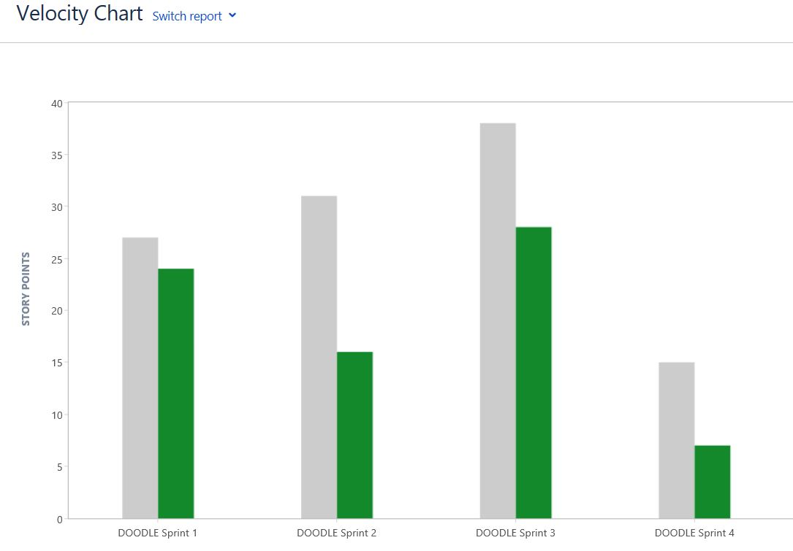

# Project Log

# Table of Contents
- [Project Log](#project-log)
- [Table of Contents](#table-of-contents)
  - [Introduction](#introduction)
  - [Sprint 0](#sprint-0)
    - [Overview](#overview)
  - [Sprint 1](#sprint-1)
    - [Overview](#overview-1)
    - [Demo](#demo)
    - [Retrospective](#retrospective)
  - [Sprint 2](#sprint-2)
    - [Overview](#overview-2)
    - [Demo](#demo-1)
    - [Retrospective](#retrospective-1)
  - [Sprint 3](#sprint-3)
    - [Overview](#overview-3)
    - [Demo](#demo-2)
    - [Retrospective](#retrospective-2)
  - [Sprint 4](#sprint-4)
    - [Overview](#overview-4)
    - [Demo](#demo-3)
    - [Retrospective](#retrospective-3)
  - [Sprint 5](#sprint-5)
    - [Overview](#overview-5)
    - [Demo](#demo-4)
    - [Retrospective](#retrospective-4)

## Introduction

This is a log of how each sprint went for us

## Sprint 0

### Overview

## Sprint 1

### Overview

### Demo

### Retrospective

**Stop Doing**

N/A

**Keep Doing**

Every memeber of the team has added to the project

**Improvements**

Need to document the retro process

The roles each week need to be clearly defined & people should know who's doing what

Some people still haven't all the necessary access

Focus on better communication

Understand & embrace the idea of what others are doing

Long term plan i.e. are all the tasks in the backlog?

## Sprint 2

### Overview

### Demo

### Retrospective

**Stop Doing**

Waiting on recording functionality in Blackboard

**Keep Doing**

The POC readmes are very good

Hangouts handy for screen sharing

**Improvements**

Stories need to be updated/closed out better, too many getting carried from sprint to sprint

Using Blackboard isn't helping the project

The whole team need to keep an eye out for PR's and action them, if possible

Get better at estimating

Need a walkthrough of the full system & how it will all hang together for the team members with lesser technical knowledge

## Sprint 3

### Overview

### Demo

### Retrospective

**Stop Doing**

N/A

**Keep Doing**

Good work on the POCs

You get less distracted if I’m clear about what I want to accomplish before I sit down at the computer

**Improvements**

Need to start work on infrastructure soon

No connectivity to lyit data centre

Vpn doesn't work

Can't setup meetings on blackboard

No means to record meetings

## Sprint 4

### Overview

### Demo

### Retrospective

**Stop Doing**

N/A

**Keep Doing**

Good team collaboration

It works better to get away from the keyboard when I’m thinking through a tough problem

**Improvements**

Vms are very slow

No access to update settings on jira

## Sprint 5

### Overview

### Demo

### Retrospective

**Stop Doing**

N/A

**Keep Doing**

Great work on the api and UI

Infrastructure is starting to come together

Providing context up front improves how messages are received

**Improvements**

Jira is too slow

There are better, more up to date tools for us to use

Presentation for the company audit was a waste of time

Tooling is very poor

Too many things on at the one time to give this project time

Requirements for the project are poor

Crowsoft have our slack channel flooded
